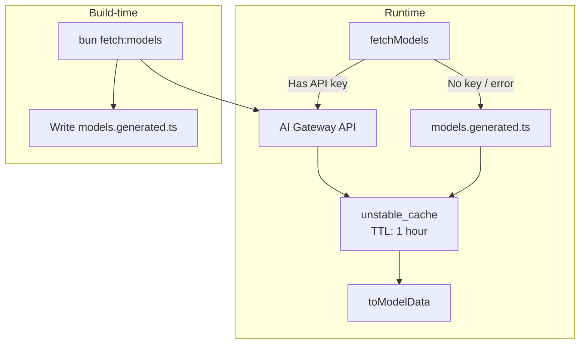

Keep your model list fresh without redeploying. This pattern fetches available models from an API at runtime, caches the result, and falls back to a generated snapshot when the API is unavailable.

## Architecture Overview



**Two layers:**

1. **Runtime fetch** - Live API calls cached for 1 hour
2. **Build-time snapshot** - Static fallback when API unavailable

## How It Works

### 1. Define the API Schema

Create a Zod schema for your model provider's response:

```ts title="lib/ai/ai-gateway-models-schemas.ts"
import { z } from "zod";

const aiGatewayModelSchema = z.object({
  id: z.string(),
  object: z.literal("model"),
  created: z.number(),
  owned_by: z.string(),
  name: z.string(),
  description: z.string(),
  context_window: z.number(),
  max_tokens: z.number(),
  type: z.union([
    z.literal("language"),
    z.literal("embedding"),
    z.literal("image"),
  ]),
  tags: z.array(z.string()).optional(),
  pricing: z.object({
    input: z.string().optional(),
    output: z.string().optional(),
    input_cache_read: z.string().optional(),
    input_cache_write: z.string().optional(),
    web_search: z.string().optional(),
    image: z.string().optional(),
    input_tiers: z
      .array(z.object({ cost: z.string(), min: z.number(), max: z.number().optional() }))
      .optional(),
    output_tiers: z
      .array(z.object({ cost: z.string(), min: z.number(), max: z.number().optional() }))
      .optional(),
  }),
});

export type AiGatewayModel = z.infer<typeof aiGatewayModelSchema>;

export const aiGatewayModelsResponseSchema = z.object({
  object: z.literal("list"),
  data: z.array(aiGatewayModelSchema),
});
```

### 2. Create the Fallback Snapshot

Generate an initial empty file that will hold the snapshot:

```ts title="lib/ai/models.generated.ts"
import type { AiGatewayModel } from "./ai-gateway-models-schemas";

export const models = [] as const satisfies readonly AiGatewayModel[];
```

### 3. Implement the Fetcher with Fallback

```ts title="lib/ai/models.ts"
import { unstable_cache } from "next/cache";
import { aiGatewayModelsResponseSchema } from "./ai-gateway-models-schemas";
import { models as fallbackModels } from "./models.generated";
import { toModelData, type ModelData } from "./model-data";

const API_URL = "https://ai-gateway.vercel.sh/v1/models";

async function fetchModelsRaw() {
  const apiKey = process.env.AI_GATEWAY_API_KEY;

  if (!apiKey) {
    console.warn("No API key, using fallback models");
    return fallbackModels;
  }

  try {
    const response = await fetch(API_URL, {
      headers: { Authorization: `Bearer ${apiKey}` },
    });

    if (!response.ok) {
      console.error(`API error: ${response.status}`);
      return fallbackModels;
    }

    const json = await response.json();
    const parsed = aiGatewayModelsResponseSchema.safeParse(json);

    if (!parsed.success) {
      console.error("Schema validation failed:", parsed.error);
      return fallbackModels;
    }

    console.info(`Fetched ${parsed.data.data.length} models from API`);
    return parsed.data.data;
  } catch (error) {
    console.error("Fetch failed:", error);
    return fallbackModels;
  }
}

export const fetchModels = unstable_cache(
  async (): Promise<ModelData[]> => {
    const models = await fetchModelsRaw();
    return models.map(toModelData);
  },
  ["ai-gateway-models"],
  { revalidate: 3600, tags: ["ai-gateway-models"] }
);
```

**Key points:**

- All errors fall back to the snapshot (never throws)
- Zod validates the response before use
- `unstable_cache` stores results for 1 hour
- Cache tag enables manual invalidation via `revalidateTag()`

### 4. Add Computed Fields (Optional)

The API returns capabilities as a `tags` array (e.g., `["reasoning", "tool-use", "vision"]`). You can transform these into boolean flags for easier filtering:

```ts title="lib/ai/model-data.ts"
import type { AiGatewayModel } from "./ai-gateway-models-schemas";

export type ModelData = AiGatewayModel & {
  reasoning: boolean;
  toolCall: boolean;
  input: { image: boolean; text: boolean; pdf: boolean };
  output: { image: boolean; text: boolean };
};

export function toModelData(model: AiGatewayModel): ModelData {
  const tags = model.tags ?? [];
  return {
    ...model,
    reasoning: tags.includes("reasoning"),
    toolCall: tags.includes("tool-use"),
    input: {
      image: tags.includes("vision") || model.type === "image",
      text: model.type === "language",
      pdf: tags.includes("file-input"),
    },
    output: {
      image: tags.includes("image-generation") || model.type === "image",
      text: model.type === "language",
    },
  };
}
```

This step is optional. If you prefer working with the raw `tags` array, skip this transformation and return `AiGatewayModel[]` directly from `fetchModels()`.

### 5. Create the Sync Script

Write a script to refresh the fallback snapshot:

```ts title="scripts/fetch-models.ts"
const API_URL = "https://ai-gateway.vercel.sh/v1/models";
const OUTPUT_PATH = "lib/ai/models.generated.ts";

async function main() {
  const apiKey = process.env.AI_GATEWAY_API_KEY;
  if (!apiKey) throw new Error("AI_GATEWAY_API_KEY required");

  const response = await fetch(API_URL, {
    headers: { Authorization: `Bearer ${apiKey}` },
  });

  if (!response.ok) {
    throw new Error(`API error: ${response.status}`);
  }

  const json = await response.json();
  const models = json.data;

  const content = `import type { AiGatewayModel } from "./ai-gateway-models-schemas";

export const models = ${JSON.stringify(models, null, 2)} as const satisfies readonly AiGatewayModel[];
`;

  await Bun.write(OUTPUT_PATH, content);
  console.log(`Wrote ${models.length} models to ${OUTPUT_PATH}`);
}

main();
```

Add to package.json:

```json title="package.json"
{
  "scripts": {
    "fetch:models": "bun scripts/fetch-models.ts && bun format"
  }
}
```

Run periodically to keep the fallback fresh:

```bash
bun fetch:models
```

## Caching Strategy

| Layer | Cache Key | TTL | Tag |
| ----- | --------- | --- | --- |
| API response + transform | `["ai-gateway-models"]` | 1 hour | `ai-gateway-models` |

To invalidate the cache manually:

```ts
import { revalidateTag } from "next/cache";
revalidateTag("ai-gateway-models");
```

## Key Files

| File | Purpose |
| ---- | ------- |
| `lib/ai/ai-gateway-models-schemas.ts` | Zod schema for API response |
| `lib/ai/models.generated.ts` | Static fallback snapshot |
| `lib/ai/models.ts` | Runtime fetcher with cache |
| `lib/ai/model-data.ts` | Type definitions and transforms |
| `scripts/fetch-models.ts` | Build-time sync script |

## Gotchas

- **Dev vs Prod caching**: `unstable_cache` behaves differently in development. Restart the dev server to see cache changes.
- **Next.js specific**: `unstable_cache` requires Next.js. For other frameworks, use Redis or in-memory caching.
- **Snapshot size**: The generated file can be large (40KB+). This is acceptable for build-time inclusion.

## Related

- [Multi-Model Support](/core/multi-model) for user-facing model configuration
