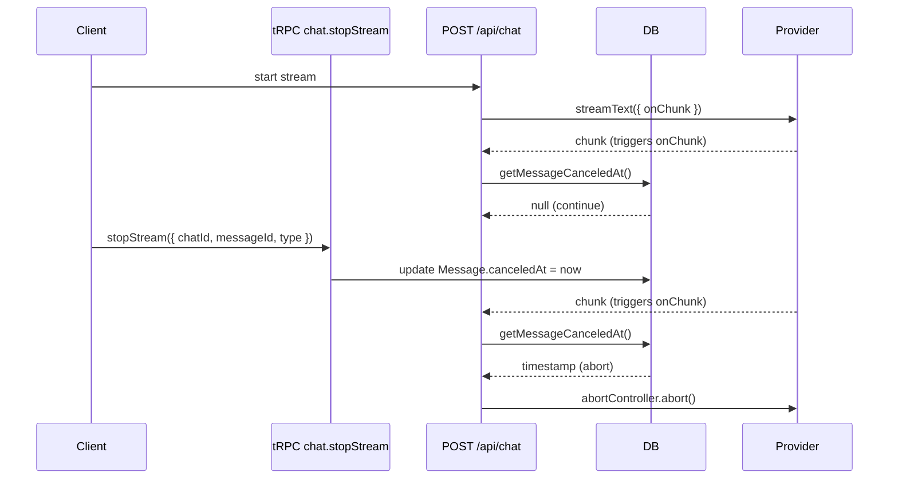

## Problem

You want a user to stop an in-flight response without killing resumable streams. Calling `stop()` on the client only ends the UI stream. The provider keeps generating tokens and you keep paying.

## Solution

Store a `canceledAt` timestamp on the message, not the chat. For unpublished
responses, also record cancellation against the assistant ID derived from the
user message. The stream loop polls `canceledAt` and aborts the provider with a
server-owned `AbortController`.

Using message-level cancellation (instead of chat-level) is more precise since each message has its own stream state, aligning with the existing `activeStreamId` pattern on messages.

## Prerequisites

- Resumable streams already enabled in `app/(chat)/api/chat/route.ts`
- Database migrations are up to date
- You have tRPC access from the client

## How it works

1. Client calls `trpc.chat.stopStream` with `{ chatId, messageId, type }`
2. `type: "request"` records cancellation against the unpublished assistant ID derived from the user message. `type: "message"` cancels an already persisted assistant
3. `cancelActiveMessage` sets `canceledAt` and clears `activeStreamId` when that row exists
4. The `onChunk` callback (throttled to 1/sec) polls `canceledAt` on each token
5. When `canceledAt` is set, calls `abortController.abort()`
6. Finalization's `updateMessage` requires `canceledAt IS NULL`, so a cancel that commits first is not overwritten

## Basic use case

Add a stop mutation and call it from the stop button.

```ts title="trpc/routers/chat.router.ts"
stopStream: protectedProcedure
  .input(
    z.discriminatedUnion("type", [
      z.object({
        chatId: z.string().uuid(),
        messageId: z.string().uuid(),
        type: z.literal("message"),
      }),
      z.object({
        chatId: z.string().uuid(),
        messageId: z.string().uuid(),
        type: z.literal("request"),
      }),
    ])
  )
  .mutation(async ({ ctx, input }) => {
    const chat = await getChatById({ id: input.chatId });
    if (chat && chat.userId !== ctx.user.id) {
      throw new TRPCError({
        code: "NOT_FOUND",
        message: "Chat not found or access denied",
      });
    }

    const canceledAt = new Date();
    if (input.type === "message") {
      const [targetMessage] = await getMessageById({ id: input.messageId });
      if (!(chat && targetMessage) || targetMessage.chatId !== input.chatId) {
        throw new TRPCError({
          code: "NOT_FOUND",
          message: "Message not found",
        });
      }

      await cancelActiveMessage({
        canceledAt,
        chatId: input.chatId,
        messageId: input.messageId,
      });
      return { success: true };
    }

    await requestGenerationCancellation({
      canceledAt,
      chatId: input.chatId,
      messageId: input.messageId,
      userId: ctx.user.id,
    });
    await cancelActiveMessage({
      canceledAt,
      chatId: input.chatId,
      messageId: input.messageId,
    });

    return { success: true };
  }),
```

```tsx title="components/multimodal-input.tsx"
const stopStreamMutation = useMutation(
  trpc.chat.stopStream.mutationOptions()
);
const lastMessageId = useLastMessageId();

const handleStop = useCallback(() => {
  if (session?.user && lastMessageId) {
    stopStreamMutation.mutate({
      chatId,
      messageId: lastMessageId,
      type: "message",
    });
  }
  stopHelper?.();
}, [chatId, lastMessageId, session?.user, stopHelper, stopStreamMutation]);
```

## Server-side polling via onChunk

Instead of a separate interval watcher, poll `canceledAt` inside the `onChunk` callback. This fires every time the model emits a token, throttled to once per second to avoid DB spam.

```ts title="app/(chat)/api/chat/route.ts"
// Create throttled cancel check (max once per second) for authenticated users
const onChunk =
  !isAnonymous && userId
    ? throttle(async () => {
        const canceledAt = await getMessageCanceledAt({ messageId });
        if (canceledAt) {
          abortController.abort();
        }
      }, 1000)
    : undefined;

// Pass to createChatStream
const stream = await createChatStream({
  // ...other params
  onChunk,
});
```

The `onChunk` callback is passed through `createChatStream` into `createCoreChatAgent`, which forwards it to the AI SDK's `streamText` call. Each chunk emitted by the model triggers the throttled check.

The final database write must also require `canceledAt IS NULL`. Chunk polling is intentionally throttled, so a fast response can finish between checks. Cancellation and finalization therefore form a database race: `cancelActiveMessage` stamps `canceledAt` and clears `activeStreamId`, while `updateMessage` refuses to overwrite a cancellation that committed first.

## Flow



## Key files

- `app/(chat)/api/chat/route.ts`
- `trpc/routers/chat.router.ts`
- `components/multimodal-input.tsx`
- `lib/db/schema.ts`
- `lib/db/queries.ts`

## Related

- [Resumable Streams](./resumable-streams)
