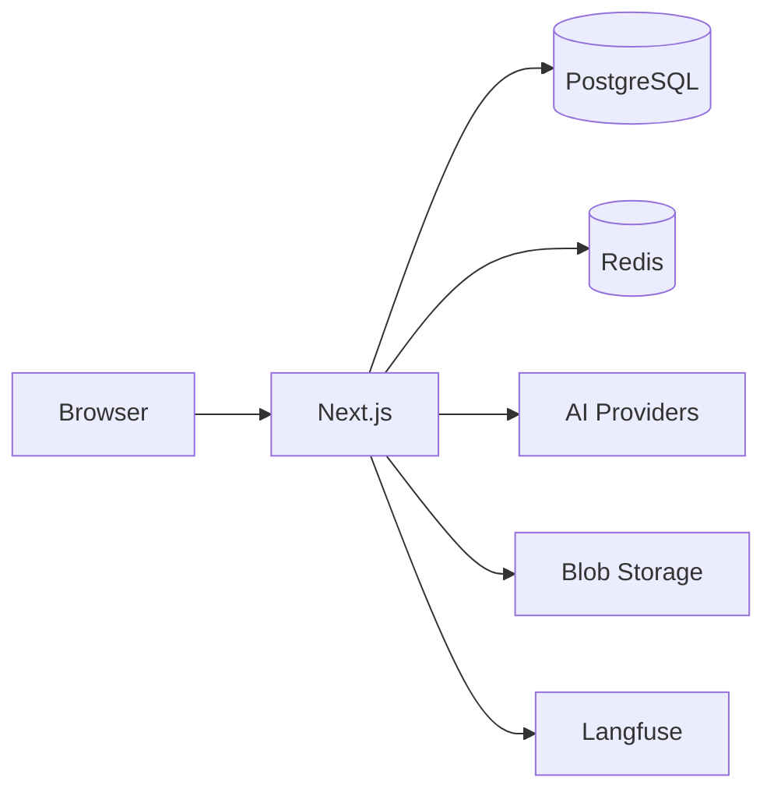
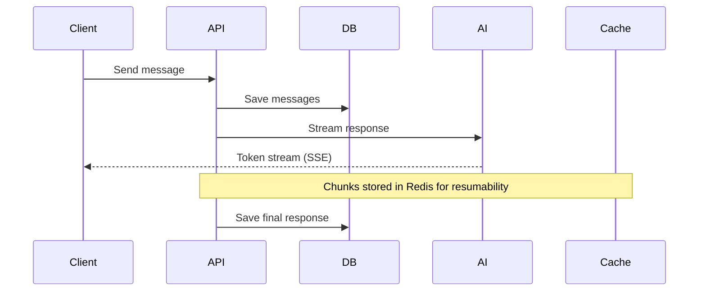

## System Overview

The application uses:
- **Next.js App Router** for the frontend and API routes
- **PostgreSQL** (via [Drizzle ORM](https://orm.drizzle.team)) for persistent data (users, chats, messages, documents)
- **Redis** for ephemeral data (resumable streams, caching). See [Resumable Streams](/cookbook/resumable-streams)
- **AI SDK** to connect to multiple AI providers through a [gateway abstraction](/gateways/overview)
- **Blob Storage** ([Vercel Blob](https://vercel.com/storage/blob)) for file attachments and generated images
- **tRPC** for end-to-end type-safe API routes between client and server
- **Langfuse** (optional) for LLM observability, tracing, and analytics

## Chat Message Flow

When a user sends a message:

Messages are stored with normalized **parts** (text, tool calls, files, reasoning) allowing efficient querying and streaming updates.

If [resumable streams](/cookbook/resumable-streams) are enabled, response chunks are published to Redis so clients can reconnect mid-generation without losing progress.

## Configuration

All settings flow from a single source:

1. `chat.config.ts` - Your configuration
2. `lib/config/` - Parse and apply defaults
3. `lib/env.ts` - Validate environment variables
4. Runtime - Features enabled/disabled

This ensures type-safe configuration and build-time validation of environment variables. See [Configuration](/core/configuration) for the full reference.
