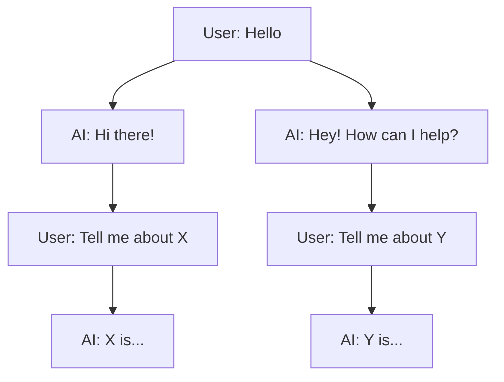

Branching lets you fork a conversation at any point and explore different directions. When you re-submit a message or the AI generates a new response, a branch is created automatically. You can navigate between branches using the sibling controls that appear on messages.

<Frame>
  
</Frame>

## How It Works

Every message stores a `parentMessageId` that forms a tree structure. When you edit a message or regenerate a response, a new child is added under the same parent, creating siblings. The UI displays the active thread (a single root-to-leaf path through the tree) while keeping all branches available.

## Navigating Branches

When a message has siblings (alternative versions), arrow controls appear next to it showing the current position (e.g., "2/3"). Click the left or right arrows to switch between branches.

Switching branches:

- Stops any active stream
- Clears buffered data
- Closes artifacts that belong to the previous branch
- Loads the full thread from the selected sibling down to its most recent leaf

## Data Model

Messages are stored with a `parentMessageId` column in the database. Root messages have a `null` parent. This creates a tree where each node can have multiple children (siblings).

## Architecture

The branching system has three layers:

### Tree Utilities (`lib/thread-utils.ts`)

Pure functions that operate on the message tree:

- `buildThreadFromLeaf` - walks `parentMessageId` links from a leaf to the root to construct the active thread
- `buildChildrenMap` - creates a parent-to-children index sorted by creation time
- `getDefaultThread` - finds the most recent leaf and builds the thread to it
- `findLeafDfsToRightFromMessageId` - DFS to find the rightmost leaf from a given node (used when switching branches)

### Zustand Middleware (`lib/stores/with-threads.ts`)

A `withThreads` middleware wraps the base chat store and adds:

- `allMessages` - the complete message tree (all branches)
- `childrenMap` - reactive parent-to-children index, rebuilt when `allMessages` changes
- `getMessageSiblingInfo` - looks up siblings and current index for any message
- `switchToSibling` - finds the target sibling, walks to its rightmost leaf, builds the new thread, and swaps it in
- `threadEpoch` - a counter that bumps on thread switches, used as a React key to remount `useChat`

### Server Sync (`components/message-tree-sync.tsx`)

`MessageTreeSync` is a renderless component that fetches the full message tree from the server via React Query and feeds it into the Zustand store with `setAllMessages`. It also handles resetting state when navigating to the home page.
