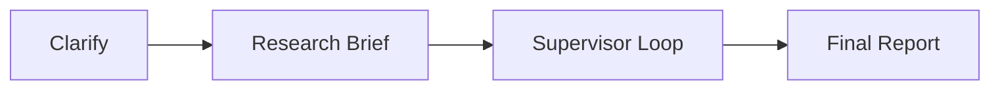

## Overview

Deep Research is an autonomous agent that conducts multi-step research on complex topics. It breaks down research questions, executes parallel web searches, synthesizes findings, and produces comprehensive reports saved as documents.

## Quick Start

Enable deep research in `chat.config.ts`:

```ts
features: {
  deepResearch: true,
}
```

Deep research uses the same search provider as [web search](/features/web-search). Configure one of the supported providers:

```bash
# Option 1: Tavily (recommended)
TAVILY_API_KEY=your_tavily_key

# Option 2: Firecrawl
FIRECRAWL_API_KEY=your_firecrawl_key
```

## How It Works

Deep research executes a 4-step pipeline:



### Step 1: Clarification

If enabled, the agent analyzes the user's request and asks clarifying questions when the scope is ambiguous. This ensures the research stays focused.

When clarification is needed:
- The agent responds with a question and pauses execution
- You provide the requested information in your next message
- If you explicitly selected the deep research tool, it remains selected after you respond
- Research continues automatically with the clarified scope

### Step 2: Research Brief

The agent transforms the conversation into a structured research brief with a clear title and scope. This brief guides all subsequent research.

### Step 3: Supervisor Loop

A supervisor agent orchestrates the research:

1. Reads the research brief
2. Identifies topics that need investigation
3. Dispatches researcher sub-agents to gather information
4. Collects and organizes findings
5. Continues until research is complete or iteration limit is reached

Each researcher agent:
- Executes web searches on its assigned topic
- Gathers relevant information from multiple sources
- Compresses findings into concise notes

### Step 4: Final Report

The agent synthesizes all research notes into a comprehensive markdown report and saves it as a document using the [canvas](/features/canvas) feature.

## Configuration

Configure deep research behavior in `chat.config.ts`:

```ts
deepResearch: {
  allowClarification: true,        // Ask clarifying questions
  maxResearcherIterations: 1,      // Supervisor loop iterations
  maxConcurrentResearchUnits: 2,   // Topics researched in parallel
  maxSearchQueries: 2,             // Queries per research topic
},
```

Configure models in `models.defaults`:

```ts
models: {
  defaults: {
    deepResearch: "google/gemini-2.5-flash-lite",
    deepResearchFinalReport: "google/gemini-3-flash",
  },
},
```

| Option | Default | Description |
|--------|---------|-------------|
| `allowClarification` | `true` | Whether to ask clarifying questions |
| `maxResearcherIterations` | `1` | Max supervisor loop iterations |
| `maxConcurrentResearchUnits` | `2` | Topics researched in parallel |
| `maxSearchQueries` | `2` | Max search queries per research topic |
| `deepResearch` model | `gemini-2.5-flash-lite` | Model for research and supervision |
| `deepResearchFinalReport` model | `gemini-3-flash` | Model for final report generation |

<Note>
  Research uses multiple LLM calls. Consider cost implications when increasing
  iteration limits or using more expensive models.
</Note>

## UI States

The research progress is shown in real-time:

| State | Shows |
|-------|-------|
| `started` | Research has begun |
| `writing` | Writing research brief or final report |
| `thoughts` | Research topics being investigated |
| `completed` | Research finished, report available |

Each research topic shows its own progress indicator as it's being investigated.

## Output

Deep research produces a document (via the canvas feature) containing:

- Comprehensive markdown report
- Structured findings organized by topic
- Citations from web sources

The document is saved to the user's account and can be viewed, edited, and exported.
