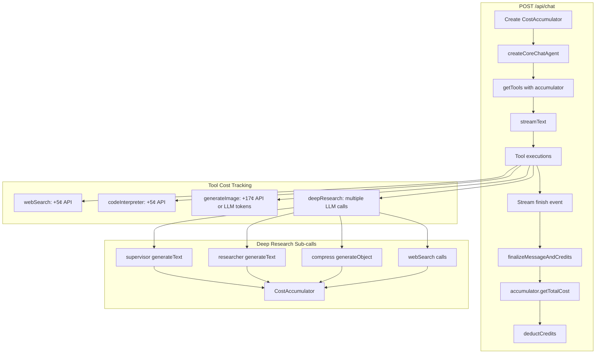

# Credit Usage Tracking

This document explains how the credit/cost tracking system works in this codebase.

## Overview

Credits are stored in **cents** and track two types of costs:

1. **LLM costs** - calculated from token usage (input/output) + model pricing
2. **API costs** - fixed costs for external services (Tavily, Sandbox, image generation)

## Architecture



## Key Components

### CostAccumulator (`lib/credits/cost-accumulator.ts`)

Central class that collects costs throughout a request:

```typescript
class CostAccumulator {
  // Add LLM cost from token usage
  addLLMCost(modelId: AppModelId, usage: UsageInfo, source: string): void;

  // Add fixed external API cost (in cents)
  addAPICost(apiName: string, cost: number): void;

  // Get total cost in cents, rounded up
  async getTotalCost(): Promise<number>;

  // Get breakdown of all cost entries
  getEntries(): CostEntry[];
}
```

### Cost Calculation (`lib/credits/cost-utils.ts`)

LLM costs are calculated from token usage and model pricing:

```typescript
// cost = (inputTokens * inputPrice + outputTokens * outputPrice) * 100
// Result is in cents, ceiled to nearest cent
```

### Tool Costs (`lib/ai/tools/tools-definitions.ts`)

Fixed API costs per tool:

| Tool            | Cost | Notes                        |
| --------------- | ---- | ---------------------------- |
| webSearch       | 5¢   | Tavily/Firecrawl API         |
| codeInterpreter | 5¢   | Sandbox execution            |
| generateImage   | 17¢  | Traditional image gen API    |
| deepResearch         | 0¢   | LLM calls tracked separately |
| createTextDocument   | 0¢   | LLM calls tracked separately |
| createCodeDocument   | 0¢   | LLM calls tracked separately |
| createSheetDocument  | 0¢   | LLM calls tracked separately |
| editTextDocument     | 0¢   | LLM calls tracked separately |
| editCodeDocument     | 0¢   | LLM calls tracked separately |
| editSheetDocument    | 0¢   | LLM calls tracked separately |

## Data Flow

### 1. Request Start (`route.ts`)

```typescript
const costAccumulator = new CostAccumulator();
```

### 2. Main Chat Stream

On stream finish, main LLM usage is added:

```typescript
if (part.type === "finish" && part.totalUsage) {
  costAccumulator.addLLMCost(selectedModelId, part.totalUsage, "main-chat");
}
```

### 3. Tool Execution

Each tool reports its costs after execution:

```typescript
// web-search.ts
costAccumulator?.addAPICost("webSearch", toolsDefinitions.webSearch.cost);

// generate-image.ts (multimodal)
costAccumulator?.addLLMCost(modelId, res.usage, "generateImage-multimodal");

// generate-image.ts (traditional)
costAccumulator?.addAPICost(
  "generateImage",
  toolsDefinitions.generateImage.cost
);
```

### 4. Deep Research (Nested Calls)

Deep research makes multiple internal LLM calls, each tracked:

```typescript
// After each generateText/generateObject call
if (result.usage) {
  this.costAccumulator?.addLLMCost(
    this.config.research_model as AppModelId,
    result.usage,
    "deep-research-researcher" // or "deep-research-supervisor", "deep-research-compress"
  );
}
```

### 5. Request End

Total cost is calculated and deducted:

```typescript
const totalCost = await costAccumulator.getTotalCost();
if (userId && !isAnonymous) {
  await deductCredits(userId, totalCost);
}
```

## Example Cost Breakdown

A deep research request might accumulate:

| Source                   | Type | Cost    |
| ------------------------ | ---- | ------- |
| main-chat                | LLM  | 2¢      |
| deep-research-supervisor | LLM  | 3¢      |
| deep-research-researcher | LLM  | 8¢      |
| deep-research-compress   | LLM  | 2¢      |
| webSearch                | API  | 5¢      |
| webSearch                | API  | 5¢      |
| **Total**                |      | **25¢** |

## Threading Pattern

The accumulator is passed through the call chain:

```mermaid
flowchart LR
    A[route.ts] -->|costAccumulator| B[createCoreChatAgent]
    B -->|costAccumulator| C[getTools]
    C -->|costAccumulator| D[deepResearch tool]
    D -->|costAccumulator| E[runDeepResearcher]
    E -->|costAccumulator| F[SupervisorAgent]
    F -->|costAccumulator| G[ResearcherAgent]
```



## Adding Cost Tracking to New Tools

1. Add `costAccumulator?: CostAccumulator` to your tool's props type
2. Accept it in `getTools()` and pass to your tool factory
3. After any LLM call, add: `costAccumulator?.addLLMCost(modelId, result.usage, "your-source")`
4. For fixed API costs, add to `toolsDefinitions` and call: `costAccumulator?.addAPICost("toolName", cost)`

## Files Reference

| File                                | Purpose                                   |
| ----------------------------------- | ----------------------------------------- |
| `lib/credits/cost-accumulator.ts`   | CostAccumulator class                     |
| `lib/credits/cost-utils.ts`         | LLM cost calculation                      |
| `lib/ai/tools/tools-definitions.ts` | Fixed API costs                           |
| `lib/ai/tools/tools.ts`             | Tool factory, passes accumulator          |
| `lib/ai/core-chat-agent.ts`         | Creates tools with accumulator            |
| `app/(chat)/api/chat/route.ts`      | Instantiates accumulator, finalizes costs |
