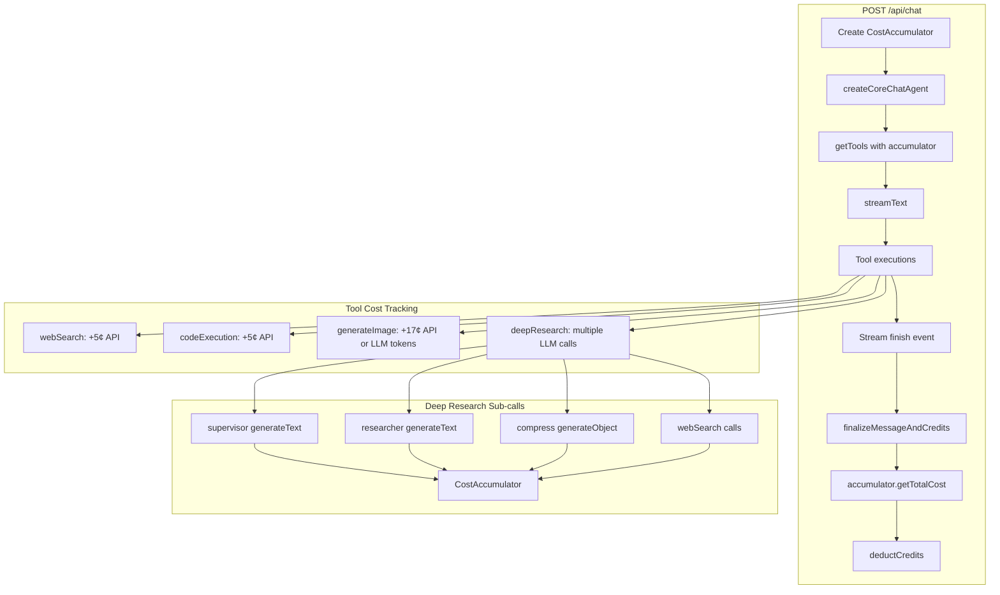

ChatJS tracks costs from LLM usage and external API calls. Authenticated users are charged in **cents** (rounded up). Anonymous users use a separate **message credit** system (cookie-backed) since you can’t reliably mutate cookies after streaming begins.

## Overview

Credits track two types of costs:

1. **LLM costs**: computed from token usage + model pricing
2. **API costs**: fixed per-tool costs (e.g. Tavily, sandbox, image generation)

## Architecture



## Tool Costs (`lib/ai/tools/tools-definitions.ts`)

Tool costs are **external API fees only** (in cents). LLM costs are accounted via token usage separately.

| Tool | Cost | Notes |
| --- | --- | --- |
| webSearch | 5¢ | Tavily |
| codeExecution | 5¢ | Vercel Sandbox execution |
| generateImage | 17¢ | Traditional image gen API (multimodal image models are billed via LLM usage instead) |
| deepResearch | 0¢ | LLM calls tracked via usage; webSearch calls tracked separately |
| createTextDocument | 0¢ | LLM calls tracked via usage |
| createCodeDocument | 0¢ | LLM calls tracked via usage |
| createSheetDocument | 0¢ | LLM calls tracked via usage |
| editTextDocument | 0¢ | LLM calls tracked via usage |
| editCodeDocument | 0¢ | LLM calls tracked via usage |
| editSheetDocument | 0¢ | LLM calls tracked via usage |
| retrieveUrl | 0¢ | Internal (Firecrawl billed via `webSearch` if you want fixed API pricing) |

## How It Works

The `CostAccumulator` collects costs throughout a request lifecycle:

1. A new accumulator is created at request start
2. The main chat stream adds LLM token costs on finish
3. Tools report their costs after execution (either LLM tokens or fixed API costs)
4. At request end, total cost is calculated and deducted from the user's balance

The accumulator is passed through the call chain so nested operations (like deep research making multiple LLM calls) can report their costs back to the same accumulator.

## Adding Cost Tracking to New Tools

To add cost tracking to a new tool:

1. Add `costAccumulator?: CostAccumulator` to your tool's props type
2. Accept it in `getTools()` and pass to your tool factory
3. After any LLM call, add: `costAccumulator?.addLLMCost(modelId, result.usage, "your-source")`
4. For fixed API costs, add to `toolsDefinitions` and call: `costAccumulator?.addAPICost("toolName", cost)`

## Anonymous User Credits

Anonymous users have a separate, simpler credit system stored in browser cookies instead of the database.

### Why Two Systems?

| Aspect | Anonymous | Authenticated |
| --- | --- | --- |
| Storage | Cookie (`anonymous-session`) | Database (`userCredit`) |
| Unit | Message count | Cents (dollars × 100) |
| Cost per request | Fixed: 1 credit | Actual LLM + API costs |
| Deduction timing | Pre-streaming | Post-streaming |
| Default balance | 10 (prod) / 1000 (dev) | Based on plan |

The message-based system for anonymous users is intentional:
- Easier to communicate ("10 free messages" vs explaining token costs)
- Pre-deduction required because cookies cannot be set after response streaming begins
- No need for database writes for unregistered users

### How Anonymous Credits Work

1. On first visit, a session is created with `ANONYMOUS_LIMITS.CREDITS` remaining
2. Session is stored as JSON in the `anonymous-session` cookie
3. Before each request, 1 credit is deducted and cookie is updated
4. When credits reach 0, user is prompted to sign up

### Configuration

Anonymous limits are configured in `chat.config.ts`:

```ts
anonymous: {
  credits: isProd ? 10 : 1000,
  // ToolName values, e.g.:
  // ["webSearch", "codeExecution", "createTextDocument", "editTextDocument"]
  availableTools: [],
  rateLimit: {
    requestsPerMinute: isProd ? 5 : 60,
    requestsPerMonth: isProd ? 10 : 1000,
  },
}
```

### Anonymous Credit Files

| File | Purpose |
| --- | --- |
| `lib/anonymous-session-client.ts` | Client-side cookie read/write |
| `lib/anonymous-session-server.ts` | Server-side cookie read/write |
| `lib/create-anonymous-session.ts` | Shared session factory |
| `lib/types/anonymous.ts` | Types and `ANONYMOUS_LIMITS` |
| `components/upgrade-cta/limit-display.tsx` | UI for remaining credits |

## Key Files

| File | Purpose |
| --- | --- |
| `lib/credits/cost-accumulator.ts` | CostAccumulator class with LLM cost calculation |
| `lib/db/credits.ts` | Credit storage (getCredits, deductCredits, addCredits) |
| `lib/ai/tools/tools-definitions.ts` | Fixed API costs per tool |
| `app/(chat)/api/chat/route.ts` | Instantiates accumulator and finalizes costs |
