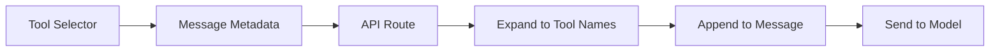

> Allow users to explicitly request tools like Canvas, Web Search, or Image Generation from the UI.

## Problem

Users want to control which AI capabilities are used for their request. Without explicit selection, the AI decides autonomously which tools to invoke based on the message content.

## Solution

Add a tool selector in the chat input that:
1. Shows available tools based on model capabilities
2. Stores the selection in message metadata
3. Expands UI selections to actual tool names
4. Appends a prompt to the message requesting those tools

## How it works



1. **UI Selection**: User picks a tool (e.g., "Canvas") from the dropdown
2. **Metadata Storage**: Selection stored as `selectedTool` in message metadata
3. **Tool Expansion**: Single UI choice expands to multiple related tools
4. **Prompt Injection**: Text appended to message requesting those tools

## Flow

### 1. Define UI Tool Options

```ts title="components/chat-features-definitions.ts"
import { Edit3, GlobeIcon, Images, type LucideIcon, Telescope } from "lucide-react";
import type { UiToolName } from "@/lib/ai/types";

type ToolDefinition = {
  name: string;
  icon: LucideIcon;
  shortName: string;
};

export const toolDefinitions: Record<UiToolName, ToolDefinition> = {
  webSearch: { name: "Web Search", icon: GlobeIcon, shortName: "Search" },
  deepResearch: { name: "Deep Research", icon: Telescope, shortName: "Research" },
  generateImage: { name: "Create an image", icon: Images, shortName: "Image" },
  createTextDocument: { name: "Canvas", icon: Edit3, shortName: "Canvas" },
  // ... other document tools share the same Canvas definition
};

// Tools shown in the selector
export const enabledTools: UiToolName[] = [
  "webSearch",
  "deepResearch",
  "generateImage",
  "createTextDocument",
];
```

### 2. Map UI Selection to Tool Names

A single UI selection can map to multiple actual tools. For example, "Canvas" enables all document creation and editing tools.

```ts title="lib/ai/determine-explicitly-requested-tools.ts"
import type { ChatTools, ToolName } from "./types";

export function determineExplicitlyRequestedTools(
  selectedTool: keyof ChatTools | null
): ToolName[] | null {
  if (selectedTool === "deepResearch") {
    return ["deepResearch"];
  }
  if (selectedTool === "webSearch") {
    return ["webSearch"];
  }
  if (selectedTool === "generateImage") {
    return ["generateImage"];
  }
  if (selectedTool === "createTextDocument") {
    // Canvas enables all document tools
    return [
      "createTextDocument",
      "createCodeDocument",
      "createSheetDocument",
      "editTextDocument",
      "editCodeDocument",
      "editSheetDocument",
    ];
  }
  return null;
}
```

### 3. Append Tool Request to Message

When tools are explicitly requested, append a text part to the user's message instructing the model.

```ts title="app/(chat)/api/chat/add-explicit-tool-request-to-messages.ts"
import type { ChatMessage, ToolName } from "@/lib/ai/types";

export function addExplicitToolRequestToMessages(
  messages: ChatMessage[],
  explicitlyRequestedTools: ToolName[] | null
) {
  const lastMessage = messages.at(-1);
  if (!lastMessage) return;

  let toolsToRequest: ToolName[] = [];

  if (explicitlyRequestedTools) {
    toolsToRequest = explicitlyRequestedTools;
  }

  if (toolsToRequest.length > 0) {
    lastMessage.parts.push({
      type: "text",
      text: `I want to use the tools ${toolsToRequest.join(", or ")}`,
    });
  }
}
```

### 4. Wire It Together in the API Route

```ts title="app/(chat)/api/chat/route.ts"
import { determineExplicitlyRequestedTools } from "@/lib/ai/determine-explicitly-requested-tools";

// In POST handler:
const selectedTool = userMessage.metadata.selectedTool ?? null;
const explicitlyRequestedTools = determineExplicitlyRequestedTools(selectedTool);

// Pass to core chat agent
const { result } = await createCoreChatAgent({
  // ...other params
  explicitlyRequestedTools,
});
```

```ts title="lib/ai/core-chat-agent.ts"
import { addExplicitToolRequestToMessages } from "@/app/(chat)/api/chat/add-explicit-tool-request-to-messages";

// Inside createCoreChatAgent:
addExplicitToolRequestToMessages(messages, explicitlyRequestedTools);
```

### 5. Build the UI Component

```tsx title="components/responsive-tools.tsx"
import { Settings2, X } from "lucide-react";
import { enabledTools, toolDefinitions } from "./chat-features-definitions";
import { DropdownMenu, DropdownMenuContent, DropdownMenuItem, DropdownMenuTrigger } from "./ui/dropdown-menu";
import { Button } from "./ui/button";

export function ResponsiveTools({
  tools,
  setTools,
  selectedModelId,
}: {
  tools: UiToolName | null;
  setTools: Dispatch<SetStateAction<UiToolName | null>>;
  selectedModelId: string;
}) {
  const activeTool = tools;

  return (
    <div className="flex items-center gap-2">
      <DropdownMenu>
        <DropdownMenuTrigger asChild>
          <Button variant="ghost" size="sm">
            <Settings2 size={14} />
            <span>Tools</span>
          </Button>
        </DropdownMenuTrigger>
        <DropdownMenuContent>
          {enabledTools.map((key) => {
            const tool = toolDefinitions[key];
            const Icon = tool.icon;
            return (
              <DropdownMenuItem
                key={key}
                onClick={() => setTools(tools === key ? null : key)}
              >
                <Icon size={14} />
                <span>{tool.name}</span>
                {tools === key && <span>✓</span>}
              </DropdownMenuItem>
            );
          })}
        </DropdownMenuContent>
      </DropdownMenu>

      {/* Show active tool chip */}
      {activeTool && (
        <Button variant="ghost" size="sm" onClick={() => setTools(null)}>
          {createElement(toolDefinitions[activeTool].icon, { size: 14 })}
          <span>{toolDefinitions[activeTool].shortName}</span>
          <X size={12} />
        </Button>
      )}
    </div>
  );
}
```

## Key files

| File | Purpose |
|------|---------|
| `components/chat-features-definitions.ts` | UI tool definitions (name, icon, shortName) |
| `components/responsive-tools.tsx` | Tool selector dropdown component |
| `lib/ai/determine-explicitly-requested-tools.ts` | Maps UI selection to actual tool names |
| `app/(chat)/api/chat/add-explicit-tool-request-to-messages.ts` | Appends tool request prompt to message |
| `lib/ai/core-chat-agent.ts` | Calls the prompt injection function |

## Extending

To add a new tool option:

1. Add the tool definition to `toolDefinitions` in `chat-features-definitions.ts`
2. Add the key to `enabledTools` array if it should appear in the selector
3. Add a mapping case in `determineExplicitlyRequestedTools`
