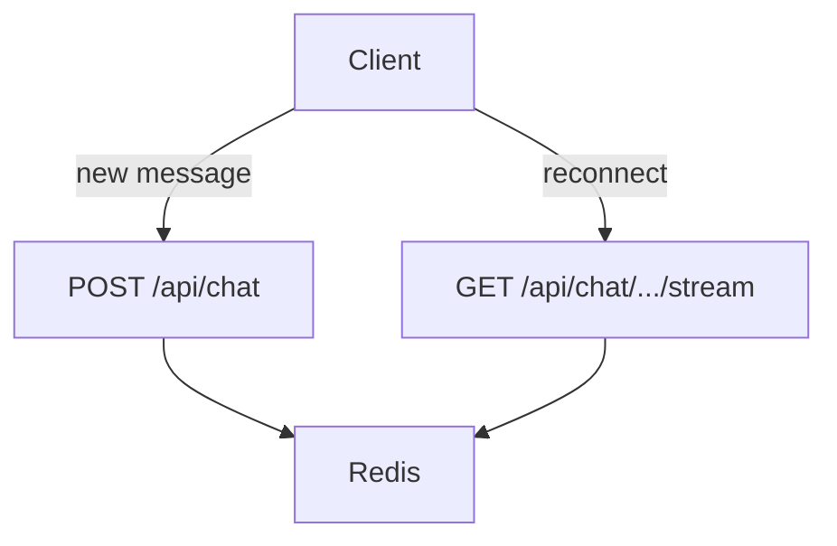

Resumable streams let `useChat` reconnect to ongoing message generation after page reloads, network interruptions, or tab switches. Without this, users lose partial AI responses and must regenerate from scratch.

## Architecture Overview



- **POST /api/chat** - Creates stream, saves message with `activeStreamId`, publishes chunks to Redis
- **GET /api/chat/[id]/stream** - Resumes stream from Redis or returns finalized message

## How It Works

### 1. Stream Creation (POST /api/chat)

When you receive a new chat request:

```ts
// Generate unique IDs
const messageId = generateUUID();
const streamId = generateUUID();

// Save placeholder message with activeStreamId marker
await saveMessage({
  id: messageId,
  chatId,
  message: {
    id: messageId,
    role: "assistant",
    parts: [],
    metadata: {
      activeStreamId: streamId, // <-- Key marker for resumability
    },
  },
});

// Create resumable stream
const streamContext = getStreamContext();
return new Response(
  await streamContext.resumableStream(streamId, () =>
    stream.pipeThrough(new JsonToSseTransformStream())
  )
);
```

The `activeStreamId` in message metadata signals that the stream is in-flight and can be resumed.

### 2. Stream Context Initialization

You need Redis for cross-instance pub/sub:

```ts
import { createResumableStreamContext } from "resumable-stream";

let globalStreamContext: ResumableStreamContext | null = null;

export function getStreamContext() {
  if (!globalStreamContext) {
    globalStreamContext = createResumableStreamContext({
      waitUntil: after, // Next.js after() for background cleanup
      keyPrefix: `${config.appPrefix}:resumable-stream`,
      publisher: redisPublisher,
      subscriber: redisSubscriber,
    });
  }
  return globalStreamContext;
}
```

### 3. Client Resume Detection

Your client detects partial messages and triggers resume:

```tsx
const lastMessage = threadInitialMessages.at(-1);
const isLastMessagePartial = !!lastMessage?.metadata?.activeStreamId;

useChat<ChatMessage>({
  resume: isLastMessagePartial, // Triggers reconnection on mount
  transport: new DefaultChatTransport({
    prepareReconnectToStreamRequest({ id: chatId }) {
      const partialMessageId = lastMessage?.metadata?.activeStreamId
        ? lastMessage.id
        : null;
      return {
        api: `/api/chat/${chatId}/stream?messageId=${partialMessageId}`,
      };
    },
  }),
});
```

### 4. Stream Resume (GET /api/chat/[id]/stream)

The resume endpoint handles three scenarios:

```ts
export async function GET(request: NextRequest, { params }) {
  const { id: chatId } = await params;
  const messageId = request.nextUrl.searchParams.get("messageId");

  const messageWithParts = await getChatMessageWithPartsById({ id: messageId });
  const { message } = messageWithParts;

  // Scenario 1: Stream already finished
  if (!message.metadata.activeStreamId) {
    return appendMessageResponse(message); // Send finalized message
  }

  // Scenario 2: Stream still active - resume it
  const streamContext = getStreamContext();
  const stream = await streamContext.resumeExistingStream(
    message.metadata.activeStreamId
  );

  if (stream) {
    return new Response(stream, { headers: UI_MESSAGE_STREAM_HEADERS });
  }

  // Scenario 3: Stream lost but message finalized (race condition)
  const refreshed = await getChatMessageWithPartsById({ id: messageId });
  if (refreshed && !refreshed.message.metadata.activeStreamId) {
    return appendMessageResponse(refreshed.message);
  }

  return new Response(null, { status: 204 });
}
```

### 5. Stream Finalization

When streaming completes, you clear the `activeStreamId`:

```ts
onFinish: async ({ messages }) => {
  const assistantMessage = messages.at(-1);
  await updateMessage({
    id: assistantMessage.id,
    chatId,
    message: {
      ...assistantMessage,
      metadata: {
        ...assistantMessage.metadata,
        activeStreamId: null, // <-- Clear marker
      },
    },
  });
};
```

On error, also clear it to prevent a stuck resumable state:

```ts
onError: (error) => {
  after(() =>
    updateMessageActiveStreamId({ id: messageId, activeStreamId: null })
  );
};
```

## Redis Key Cleanup

Set TTL on stream keys to prevent Redis bloat:

```ts
after(async () => {
  const keyPattern = `${config.appPrefix}:resumable-stream:rs:sentinel:${streamId}*`;
  const keys = await redisPublisher.keys(keyPattern);
  await Promise.all(keys.map((key) => redisPublisher.expire(key, 300))); // 5 min TTL
});
```

## Fallback Behavior

Without Redis, resumable streams are disabled:

```ts
if (!globalStreamContext) {
  console.log("> Resumable streams are disabled due to missing REDIS_URL");
}
```

Your app still works. Streams just can't be resumed after disconnection.

## Message Flow

```mermaid
sequenceDiagram
    Client->>Server: POST /api/chat
    Server-->>Client: SSE chunks (via Redis)
    Note over Client: ⚡ disconnect
    Client->>Server: GET /stream?messageId
    Server-->>Client: remaining chunks
```



## Key Implementation Details

1. **activeStreamId as state marker** - Message metadata tracks stream state
2. **Placeholder message first** - Save before streaming so resume can find it
3. **Redis pub/sub** - Enables cross-instance resumption in multi-pod deployments
4. **appendMessage fallback** - If stream finished, send the complete message as a data chunk
5. **Race condition handling** - Double-check DB if Redis stream is missing

## Stopping streams

Resumable streams stay compatible with stopping as long as you do not wire `request.signal` into `streamText`. Use a server-owned `AbortController` and a persisted stop flag instead.

See [Stop Resumable Streams](./stop-resumable-streams).

## Further Reading

- [AI SDK: Resuming Streams](https://ai-sdk.dev/docs/ai-sdk-ui/chatbot-resume-streams)
