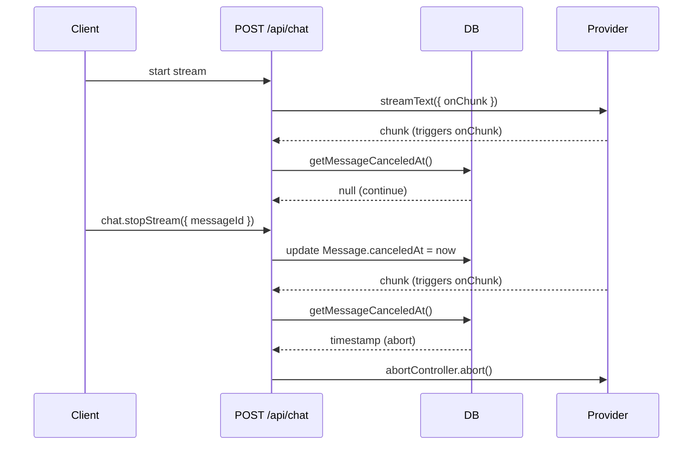

## Problem

You want a user to stop an in-flight response without killing resumable streams. Calling `stop()` on the client only ends the UI stream. The provider keeps generating tokens and you keep paying.

## Solution

Store a `canceledAt` timestamp on the message (not the chat). When the user clicks stop, set it with a tRPC mutation using the current message ID. The stream loop polls `canceledAt` and aborts the provider with a server-owned `AbortController`.

Using message-level cancellation (instead of chat-level) is more precise since each message has its own stream state, aligning with the existing `activeStreamId` pattern on messages.

## Prerequisites

- Resumable streams already enabled in `app/(chat)/api/chat/route.ts`
- Database migrations are up to date
- You have tRPC access from the client

## How it works

1. Client calls `chat.stopStream` with the current `messageId`
2. Server persists `canceledAt` on the message row
3. The `onChunk` callback (throttled to 1/sec) polls `canceledAt` on each token
4. When `canceledAt` is set, calls `abortController.abort()`
5. The provider stops and no more tokens are generated

## Basic use case

Add a stop mutation and call it from the stop button.

```ts title="trpc/routers/chat.router.ts"
stopStream: protectedProcedure
  .input(z.object({ messageId: z.string().uuid() }))
  .mutation(async ({ ctx, input }) => {
    const [msg] = await getMessageById({ id: input.messageId });
    if (!msg) {
      throw new TRPCError({
        code: "NOT_FOUND",
        message: "Message not found",
      });
    }

    const chat = await getChatById({ id: msg.chatId });
    if (!chat || chat.userId !== ctx.user.id) {
      throw new TRPCError({
        code: "NOT_FOUND",
        message: "Chat not found or access denied",
      });
    }

    await updateMessageCanceledAt({
      messageId: input.messageId,
      canceledAt: new Date(),
    });

    return { success: true };
  }),
```

```tsx title="components/multimodal-input.tsx"
const stopStreamMutation = useMutation(
  trpc.chat.stopStream.mutationOptions()
);
const lastMessageId = useLastMessageId();

const handleStop = useCallback(() => {
  if (session?.user && lastMessageId) {
    stopStreamMutation.mutate({ messageId: lastMessageId });
  }
  stopHelper?.();
}, [lastMessageId, session?.user, stopHelper, stopStreamMutation]);
```

## Server-side polling via onChunk

Instead of a separate interval watcher, poll `canceledAt` inside the `onChunk` callback. This fires every time the model emits a token, throttled to once per second to avoid DB spam.

```ts title="app/(chat)/api/chat/route.ts"
// Create throttled cancel check (max once per second) for authenticated users
const onChunk =
  !isAnonymous && userId
    ? throttle(async () => {
        const canceledAt = await getMessageCanceledAt({ messageId });
        if (canceledAt) {
          abortController.abort();
        }
      }, 1000)
    : undefined;

// Pass to createChatStream
const stream = await createChatStream({
  // ...other params
  onChunk,
});
```

The `onChunk` callback is passed through `createChatStream` into `createCoreChatAgent`, which forwards it to the AI SDK's `streamText` call. Each chunk emitted by the model triggers the throttled check.

## Flow



## Key files

- `app/(chat)/api/chat/route.ts`
- `trpc/routers/chat.router.ts`
- `components/multimodal-input.tsx`
- `lib/db/schema.ts`
- `lib/db/queries.ts`

## Related

- [Resumable Streams](./resumable-streams)
