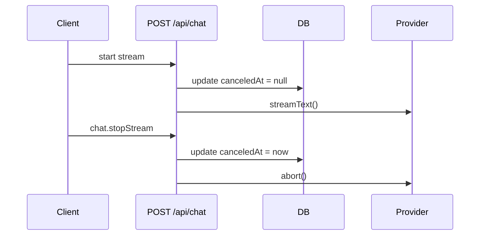

## Problem

You want a user to stop an in-flight response without killing resumable streams. Calling `stop()` on the client only ends the UI stream. The provider keeps generating tokens and you keep paying.

## Solution

Store a `canceledAt` timestamp on the chat. When the user clicks stop, set it with a tRPC mutation. The stream loop polls `canceledAt` and aborts the provider with a server-owned `AbortController`.

## Prerequisites

- Resumable streams already enabled in `app/(chat)/api/chat/route.ts`
- Database migrations are up to date
- You have tRPC access from the client

## How it works

1. Client calls `chat.stopStream` with the current `chatId`
2. Server persists `canceledAt`
3. The stream loop polls the chat row and calls `abortController.abort()`
4. The provider stops and no more tokens are generated

## Basic use case

Add a stop mutation and call it from the stop button.

```ts title="trpc/routers/chat.router.ts"
stopStream: protectedProcedure
  .input(z.object({ chatId: z.string().uuid() }))
  .mutation(async ({ ctx, input }) => {
    const chat = await getChatById({ id: input.chatId });
    if (!chat || chat.userId !== ctx.user.id) {
      throw new TRPCError({
        code: "NOT_FOUND",
        message: "Chat not found or access denied",
      });
    }

    await updateChatCanceledAt({
      chatId: input.chatId,
      canceledAt: new Date(),
    });

    return { success: true };
  }),
```

```tsx title="components/multimodal-input.tsx"
const stopStreamMutation = useMutation(
  trpc.chat.stopStream.mutationOptions()
);

const handleStop = useCallback(() => {
  if (session?.user) {
    stopStreamMutation.mutate({ chatId });
  }
  stopHelper?.();
}, [chatId, session?.user, stopHelper, stopStreamMutation]);
```

## Advanced use case

Reduce database reads by polling once per second and clearing `canceledAt` when a new stream starts.

```ts title="app/(chat)/api/chat/route.ts"
await updateChatCanceledAt({ chatId, canceledAt: null });

const stopWatcherCleanup = startChatCancelWatcher({
  chatId,
  abortController,
  enabled: !isAnonymous && !!userId,
});
```

## Flow



## Key files

- `app/(chat)/api/chat/route.ts`
- `trpc/routers/chat.router.ts`
- `components/multimodal-input.tsx`
- `lib/db/schema.ts`
- `lib/db/queries.ts`

## Related

- [Resumable Streams](./resumable-streams)
