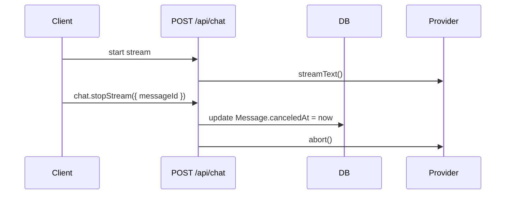

## Problem

You want a user to stop an in-flight response without killing resumable streams. Calling `stop()` on the client only ends the UI stream. The provider keeps generating tokens and you keep paying.

## Solution

Store a `canceledAt` timestamp on the message (not the chat). When the user clicks stop, set it with a tRPC mutation using the current message ID. The stream loop polls `canceledAt` and aborts the provider with a server-owned `AbortController`.

Using message-level cancellation (instead of chat-level) is more precise since each message has its own stream state, aligning with the existing `activeStreamId` pattern on messages.

## Prerequisites

- Resumable streams already enabled in `app/(chat)/api/chat/route.ts`
- Database migrations are up to date
- You have tRPC access from the client

## How it works

1. Client calls `chat.stopStream` with the current `messageId`
2. Server persists `canceledAt` on the message
3. The stream loop polls the message row and calls `abortController.abort()`
4. The provider stops and no more tokens are generated

## Basic use case

Add a stop mutation and call it from the stop button.

```ts title="trpc/routers/chat.router.ts"
stopStream: protectedProcedure
  .input(z.object({ messageId: z.string().uuid() }))
  .mutation(async ({ ctx, input }) => {
    const [msg] = await getMessageById({ id: input.messageId });
    if (!msg) {
      throw new TRPCError({
        code: "NOT_FOUND",
        message: "Message not found",
      });
    }

    const chat = await getChatById({ id: msg.chatId });
    if (!chat || chat.userId !== ctx.user.id) {
      throw new TRPCError({
        code: "NOT_FOUND",
        message: "Chat not found or access denied",
      });
    }

    await updateMessageCanceledAt({
      messageId: input.messageId,
      canceledAt: new Date(),
    });

    return { success: true };
  }),
```

```tsx title="components/multimodal-input.tsx"
const stopStreamMutation = useMutation(
  trpc.chat.stopStream.mutationOptions()
);
const lastMessageId = useLastMessageId();

const handleStop = useCallback(() => {
  if (session?.user && lastMessageId) {
    stopStreamMutation.mutate({ messageId: lastMessageId });
  }
  stopHelper?.();
}, [lastMessageId, session?.user, stopHelper, stopStreamMutation]);
```

## Server-side watcher

Poll the message's `canceledAt` once per second in the streaming route.

```ts title="app/(chat)/api/chat/route.ts"
const stopWatcherCleanup = startMessageCancelWatcher({
  messageId,
  abortController,
  enabled: !isAnonymous && !!userId,
});
```

## Flow



## Key files

- `app/(chat)/api/chat/route.ts`
- `trpc/routers/chat.router.ts`
- `components/multimodal-input.tsx`
- `lib/db/schema.ts`
- `lib/db/queries.ts`

## Related

- [Resumable Streams](./resumable-streams)
