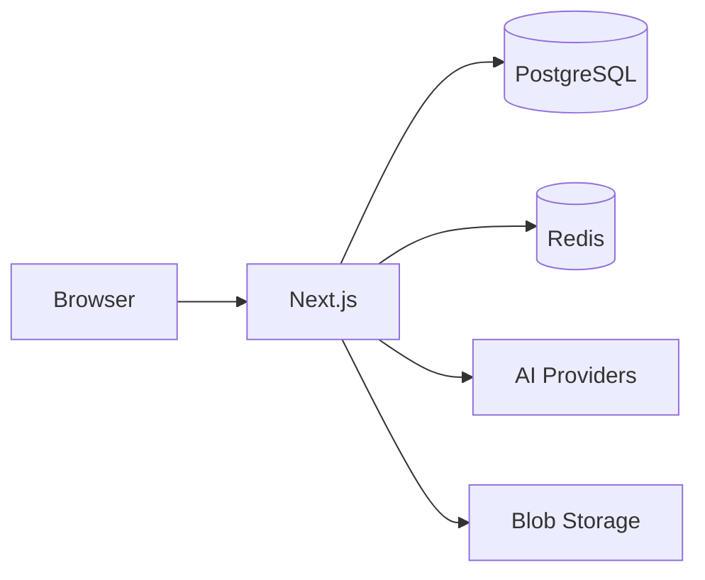
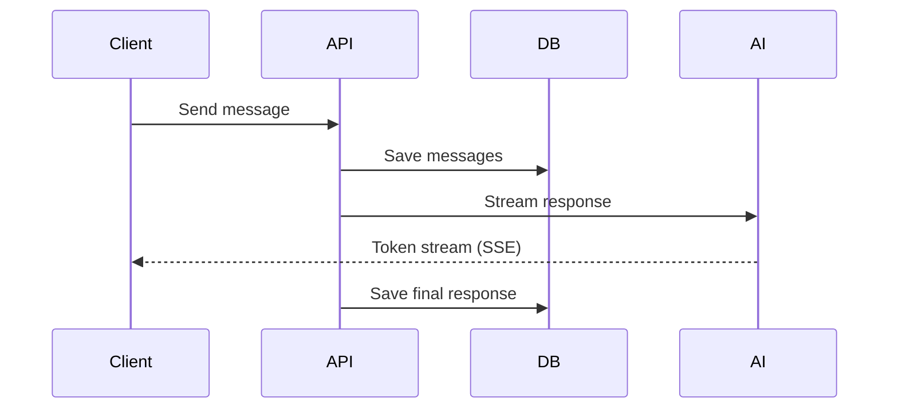

## System Overview

The application uses:
- **Next.js App Router** for the frontend and API routes
- **PostgreSQL** for persistent data (users, chats, messages)
- **Redis** for ephemeral data (active streams, caching)
- **AI SDK** to connect to multiple AI providers through a unified interface

## Chat Message Flow

When a user sends a message:

Messages are stored with normalized **parts** (text, tool calls, files, reasoning) allowing efficient querying and streaming updates.

## Configuration

All settings flow from a single source:

1. `chat.config.ts` - Your configuration
2. `lib/config/` - Parse and apply defaults
3. `lib/env.ts` - Validate environment variables
4. Runtime - Features enabled/disabled

This ensures type-safe configuration and build-time validation of environment variables.
