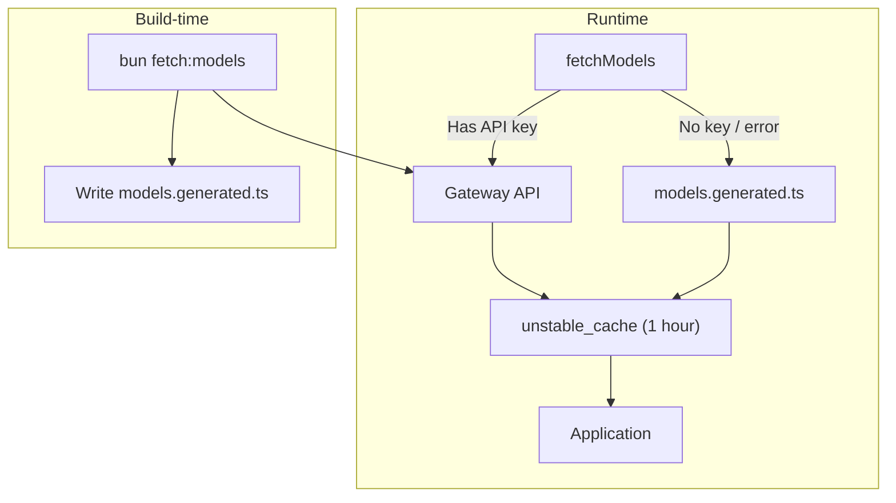

ChatJS uses a **gateway** to route all AI requests — model listing, chat completions, and image generation — through a single backend. Set `gateway` in `chat.config.ts` to choose which backend your app talks to.

## Available Gateways

| Gateway | Models | Auth | Image Generation | Best For |
|---------|--------|------|------------------|----------|
| [Vercel AI Gateway](/gateways/vercel) (default) | 120+ | `AI_GATEWAY_API_KEY` or auto OIDC | Dedicated image models | Vercel deployments |
| [OpenRouter](/gateways/openrouter) | Hundreds | `OPENROUTER_API_KEY` | Via multimodal models | Broadest model access |
| [OpenAI](/gateways/openai) | OpenAI only | `OPENAI_API_KEY` | `gpt-image-1` and others | Direct OpenAI access |
| [OpenAI Compatible](/gateways/openai-compatible) | Varies | `OPENAI_COMPATIBLE_API_KEY` (optional) | Provider-dependent | Ollama, LM Studio, vLLM, Azure |

## Choosing a Gateway

- **Vercel AI Gateway** is the default. It aggregates 120+ models from multiple providers behind a single key. Zero-config on Vercel deployments.
- **OpenRouter** gives access to hundreds of models with per-token pricing. Good when you want the widest selection or models not on Vercel's gateway.
- **OpenAI** connects directly to the OpenAI API. Use this when you only need OpenAI models and want type-safe model IDs.
- **OpenAI Compatible** works with any endpoint that follows the OpenAI API format — local servers (Ollama, LM Studio), self-hosted inference (vLLM, TGI), or cloud services (Azure OpenAI).

## Configuration

Set the gateway in `chat.config.ts`:

```typescript title="chat.config.ts"
const config: ConfigInput = {
  models: {
    gateway: "openrouter", // "vercel" | "openrouter" | "openai" | "openai-compatible"
    // ...
  },
};
```

<Note>
The `gateway` field lives inside the `models` key and defaults to `"vercel"` when omitted.
</Note>

## How Model Fetching Works

Every gateway implements `fetchModels()` which returns the list of available models. The app calls this at runtime and caches the result for 1 hour.



When no API key is available, the app falls back to a static snapshot in `models.generated.ts`. Refresh this snapshot periodically:

```bash
bun fetch:models
```

See [Auto-Updating Models](/cookbook/auto-updating-models) for the full implementation pattern.

## Gateway Architecture

All gateways implement the `GatewayProvider` interface:

```typescript
type GatewayProvider<TGateway, TModelId, TImageModelId> = {
  readonly type: TGateway;
  createLanguageModel(modelId: TModelId): LanguageModel;
  createImageModel(modelId: TImageModelId): ImageModel | null;
  fetchModels(): Promise<AiGatewayModel[]>;
};
```

The gateway registry maps gateway names to factory functions:

```typescript title="lib/ai/gateways/registry.ts"
export const gatewayRegistry = {
  vercel: () => new VercelGateway(),
  openrouter: () => new OpenRouterGateway(),
  openai: () => new OpenAIGateway(),
  "openai-compatible": () => new OpenAICompatibleGateway(),
};
```

Adding a new gateway is a matter of implementing the interface and registering it. See [Adding a Gateway](/cookbook/adding-a-gateway) for a step-by-step guide.

## Key Files

| File | Purpose |
|------|---------|
| `lib/ai/gateways/gateway-provider.ts` | `GatewayProvider` interface |
| `lib/ai/gateways/registry.ts` | Gateway registry and type exports |
| `lib/ai/gateways/*.ts` | Individual gateway implementations |
| `lib/ai/models.ts` | Runtime fetcher with cache |
| `lib/ai/models.generated.ts` | Static fallback snapshot |
| `lib/config-schema.ts` | Zod schema with discriminated union |

## Related

- [Multi-Model Support](/core/multi-model) for model configuration and visibility
- [Adding a Gateway](/cookbook/adding-a-gateway) for implementing a custom gateway
- [Auto-Updating Models](/cookbook/auto-updating-models) for the fetching and caching pattern
