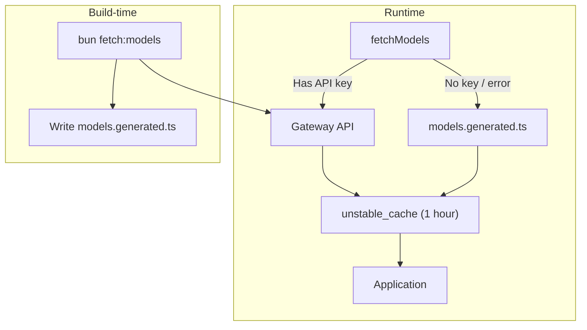

ChatJS uses a **gateway** to route all AI requests (model listing, chat completions, and image generation) through a single backend. Set `gateway` in `chat.config.ts` to choose which backend your app talks to.

## Available Gateways

| Gateway | Models | Auth | Image Generation | Best For |
|---------|--------|------|------------------|----------|
| [Vercel AI Gateway](/gateways/vercel) (default) | 120+ | `AI_GATEWAY_API_KEY` or auto OIDC | Dedicated image models | Vercel deployments |
| [OpenRouter](/gateways/openrouter) | Hundreds | `OPENROUTER_API_KEY` | Via multimodal models | Broadest model access |
| [OpenAI](/gateways/openai) | OpenAI only | `OPENAI_API_KEY` | `gpt-image-1` and others | Direct OpenAI access |
| [OpenAI Compatible](/gateways/openai-compatible) | Varies | `OPENAI_COMPATIBLE_API_KEY` (optional) | Provider-dependent | Ollama, LM Studio, vLLM, Azure |

Need a provider not listed here? See [Custom Gateway](/gateways/custom).

## Choosing a Gateway

- **Vercel AI Gateway** is the default. It aggregates 120+ models from multiple providers behind a single key. Zero-config on Vercel deployments.
- **OpenRouter** gives access to hundreds of models with per-token pricing. Good when you want the widest selection or models not on Vercel's gateway.
- **OpenAI** connects directly to the OpenAI API. Use this when you only need OpenAI models and want type-safe model IDs.
- **OpenAI Compatible** works with any endpoint that follows the OpenAI API format (local servers, self-hosted inference, or cloud services).

## Configuration

Set the gateway in `chat.config.ts`:

```typescript title="chat.config.ts"
const config: ConfigInput = {
  models: {
    gateway: "openrouter", // "vercel" | "openrouter" | "openai" | "openai-compatible"
    // ...
  },
};
```

<Note>
The `gateway` field lives inside the `models` key and defaults to `"vercel"` when omitted.
</Note>

## How Model Fetching Works

Every gateway implements `fetchModels()` which returns the list of available models. The app calls this at runtime and caches the result for 1 hour.



When no API key is available, the app falls back to a static snapshot in `models.generated.ts`. Refresh this snapshot periodically:

```bash
bun fetch:models
```

### Snapshot Gateway Validation

The snapshot file records which gateway generated it via a `generatedForGateway` export. When you run `bun check-env`, it compares this value against `config.models.gateway` and warns if they don't match:

```
⚠️  models.generated.ts was built for "vercel" but config uses "openrouter".
    Run `bun fetch:models` to update the fallback snapshot.
```

This is caught at two levels:

- **Build time**: `bun check-env` prints the warning shown above.
- **Runtime**: each gateway checks `generatedForGateway` before using the fallback. If it doesn't match, the fallback is skipped and an empty model list is returned instead of wrong model IDs.

<Tip>
After changing `gateway` in `chat.config.ts`, always run `bun fetch:models` to keep the fallback snapshot in sync.
</Tip>

See [Auto-Updating Models](/cookbook/auto-updating-models) for the full implementation pattern.

## Related

- [Multi-Model Support](/core/multi-model) for model configuration and visibility
- [Custom Gateway](/gateways/custom) for implementing your own gateway
- [Auto-Updating Models](/cookbook/auto-updating-models) for the fetching and caching pattern
